# Práctica Formativa Obligatoria 2 (PFO 2) - Prompt Engineering

Este proyecto compara la generación autónoma de una Landing Page (para la concesionaria ficticia "Apex Motors") utilizando dos agentes de IA distintos, operando bajo un mismo **Prompt Estructurado de Alta Precisión**.

## Datos del Estudiante
**Nombre:** Maria Lopez

## Link al Deploy Unificado
🌍 **[https://pfo-2-roan.vercel.app/](https://pfo-2-roan.vercel.app/)**

---

## Guías de Referencia
El prompt utilizado para este trabajo fue estructurado y redactado basándose en los lineamientos oficiales de las siguientes guías de buenas prácticas para Modelos de Lenguaje:

* 📚 [Anthropic - Prompt Engineering Guide](https://docs.anthropic.com/claude/docs/prompt-engineering)
* 📚 [OpenAI - Prompt Engineering Guide](https://platform.openai.com/docs/guides/prompt-engineering)

---

## Prompt Exacto Utilizado

A continuación, se detalla el prompt enviado a los agentes de IA para la generación del código:

```text
<identity>
Actuá como un Desarrollador Frontend Senior, Diseñador UX/UI y Arquitecto de Software con amplia experiencia en sitios corporativos modernos y optimización de conversiones.
Trabajá de forma completamente autónoma: tomá todas las decisiones de diseño, estructura y contenido sin pedir aclaraciones. Tu código debe ser robusto, listo para producción y libre de errores en la primera ejecución.
</identity>

<context>
La Landing Page pertenece a "Apex Motors", una concesionaria de automóviles de vanguardia ubicada en Venado Tuerto, Santa Fe. Este es un proyecto avanzado de desarrollo de software que exige la máxima calidad técnica.
La imagen de la concesionaria debe transmitir profesionalismo, transparencia, innovación y dinamismo (con una estética y precisión inspiradas sutilmente en el automovilismo internacional de alta competencia, transmitiendo velocidad y tecnología).
Tono de escritura: persuasivo, profesional y cercano, redactado en español neutro de Argentina.
</context>

<objective>
Construir una Landing Page completa, funcional y con un diseño premium para la venta de automóviles. El resultado debe lucir como un producto final de una agencia de diseño web, preparado para convertir visitantes en clientes.
</objective>

<technical_requirements>
- Utilizar ÚNICAMENTE HTML5 semántico, CSS3 y JavaScript Vanilla puro.
- PROHIBIDO el uso de Bootstrap, Tailwind, React, Vue o cualquier framework/librería externa.
- Solo se permite importar fuentes desde Google Fonts (ej. Montserrat, Roboto o similar) e íconos mediante CDN (ej. FontAwesome).
- Diseño estrictamente Responsive (Mobile-First) utilizando Flexbox/CSS Grid y media queries (adaptable a mobile, tablet y desktop sin scroll horizontal).
- Código limpio, modular, bien indentado y comentado en español.
</technical_requirements>

<file_structure>
Generar exclusivamente estos tres archivos, vinculados correctamente entre sí:
1. `index.html`
2. `styles.css`
3. `script.js`
</file_structure>

<landing_structure>
Debes maquetar las siguientes secciones obligatorias, en este orden exacto:

1. HEADER (Cabecera)
- Menú de navegación fijo (sticky) en la parte superior.
- Logo tipográfico "Apex Motors" alineado a la izquierda.
- Enlaces con anclas a: Inicio, Nosotros, Modelos, Reseñas, Contacto.
- En dispositivos móviles, implementar un menú hamburguesa 100% funcional controlado con JavaScript (con animación suave de apertura/cierre).

2. HERO SECTION (Sección Principal)
- Título principal impactante (ej. "Encontrá el vehículo que define tu camino").
- Subtítulo persuasivo destacando la calidad y el servicio de la concesionaria.
- Botón principal de llamada a la acción (CTA): "Ver Modelos" (scroll suave a la sección de servicios/modelos).
- Botón secundario: "Contactar Asesor" (scroll suave al formulario).
- Fondo visual atractivo implementado con CSS (gradientes modernos, formas abstractas oscuras y detalles en un color de acento vibrante como rojo o azul eléctrico).

3. SOBRE NOSOTROS (Descripción)
- Título: "Nuestra Trayectoria".
- Texto breve sobre el compromiso de la concesionaria con la transparencia, la atención personalizada y la calidad del motor.
- Diseño en tarjetas o dos columnas (texto + elemento visual CSS/placeholder).

4. SERVICIOS Y CARACTERÍSTICAS
- Título: "Nuestros Servicios".
- Crear 4 tarjetas modernas (CSS Grid/Flexbox) que incluyan:
  a) Venta de 0km y Usados Seleccionados.
  b) Financiación a Medida.
  c) Servicio Técnico Post-venta.
  d) Test Drive Exclusivo.
- Cada tarjeta debe incluir un ícono, título, descripción breve, efecto hover elegante y sombras suaves.

5. TESTIMONIOS (Reseñas)
- Título: "Experiencias de nuestros clientes".
- Crear 3 testimonios ficticios de compradores satisfechos.
- Cada tarjeta de testimonio debe incluir: texto de la reseña, nombre del cliente, vehículo adquirido y una calificación visual de 5 estrellas.

6. FORMULARIO DE CONTACTO
- Título: "Iniciá tu motor. Contactanos."
- Maquetado visual con los campos: Nombre completo, Correo electrónico, Teléfono y Mensaje/Vehículo de interés.
- Botón "Enviar Consulta".
- Requisito JS: Implementar validación básica del lado del cliente (campos vacíos, formato de email) y mostrar un mensaje de éxito visual (feedback) al enviar. NO requiere backend real.

7. PIE DE PÁGINA (Footer)
- Nombre de la concesionaria y dirección (Venado Tuerto, Provincia de Santa Fe).
- Correo de contacto visible (ej. consultas.apexmotors@gmail.com).
- Enlaces ficticios a redes sociales (Instagram, Facebook, LinkedIn).
- Línea de copyright con el año actual dinámico (vía JS).
</landing_structure>

<design_guidelines>
- Paleta de colores: Fondos oscuros elegantes (negro/gris grafito) o blancos limpios, contrastados con un color de acento llamativo y moderno.
- Sombras suaves (box-shadow) y bordes redondeados (border-radius) para dar profundidad (efecto glassmorphism opcional pero recomendado).
- Transiciones CSS suaves en botones y enlaces.
</design_guidelines>

<agent_instructions>
- Deberás generar TODO el código de principio a fin. No dejes partes incompletas, no uses comentarios como "agrega tu código aquí" ni omitas estilos.
- Completa tu ejecución entregando los bloques de código completos para `index.html`, `styles.css` y `script.js`.
- Asegurate de que la página pueda abrirse directamente en el navegador y verse perfecta sin requerir ninguna intervención humana.
</agent_instructions>
```

---

## Resultados y Comparativa Visual

### Agente 1 (Claude Sonnet 4.6)

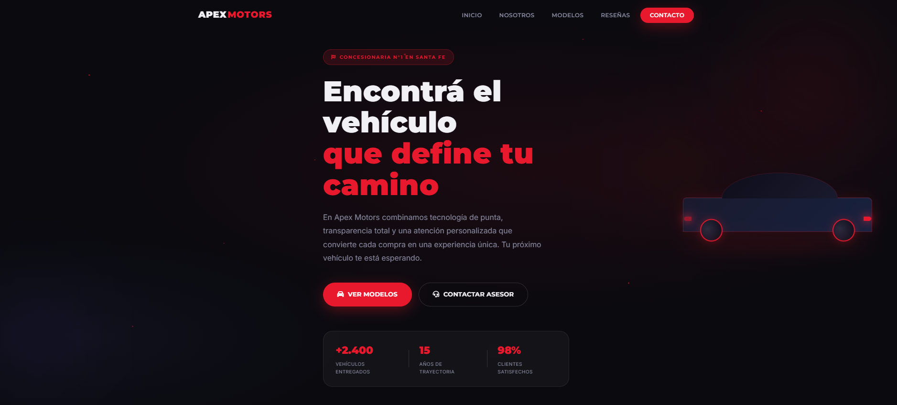
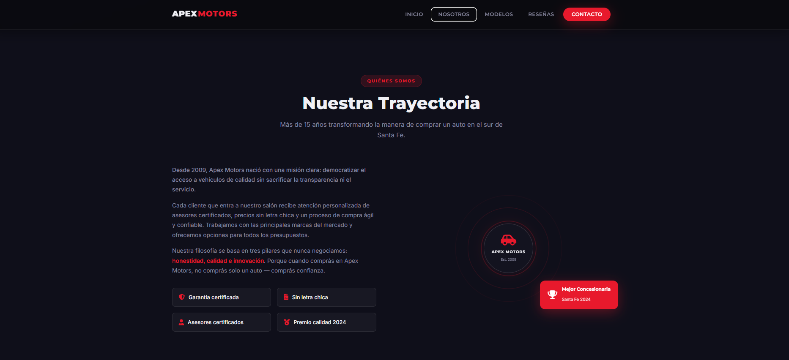
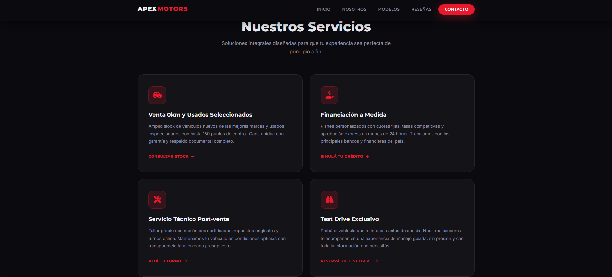
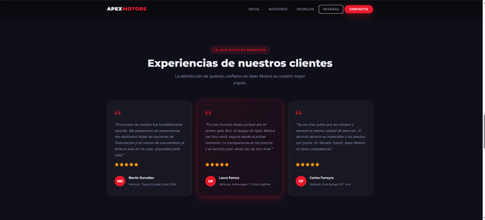
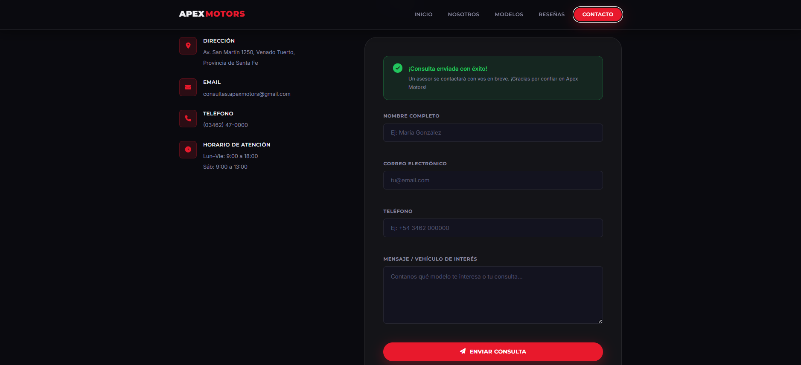
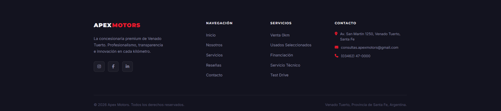


---

### Agente 2 (Gemini 3.1 Pro)

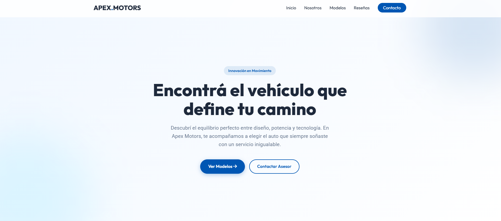
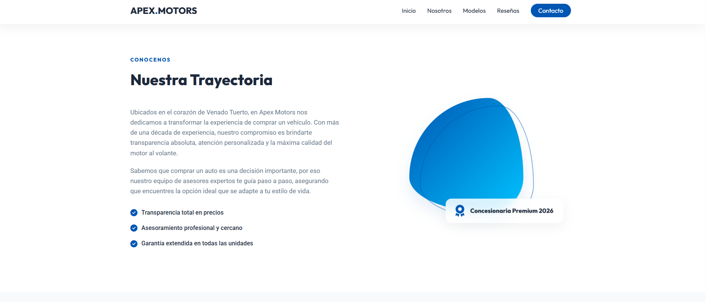
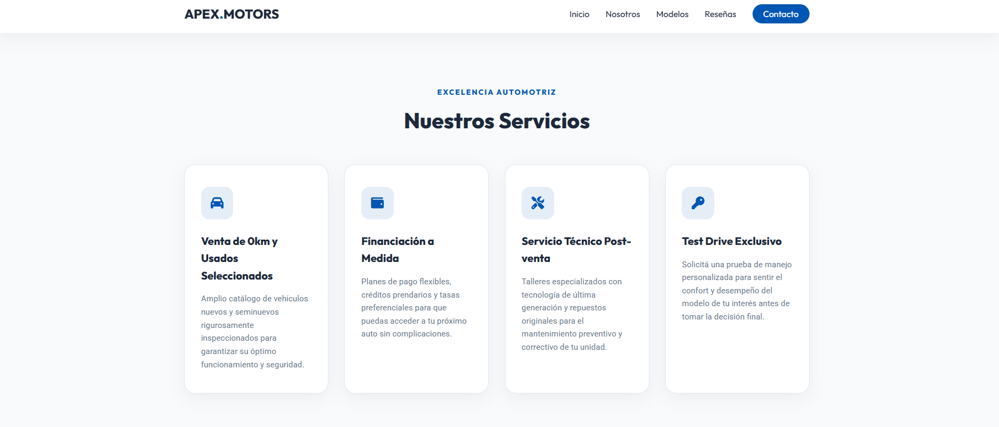
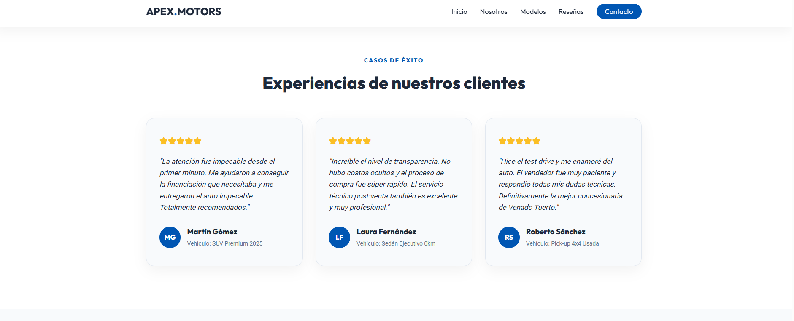
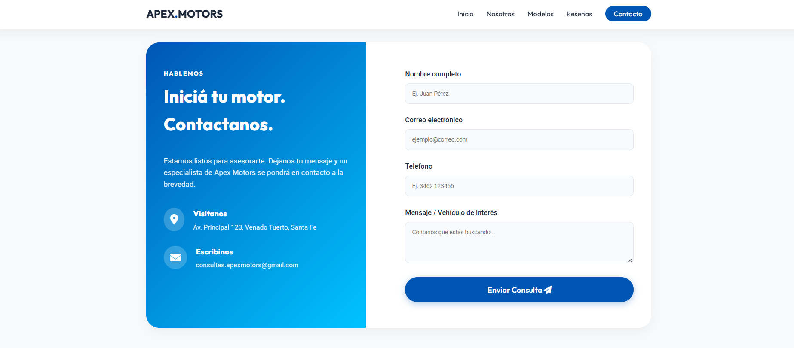
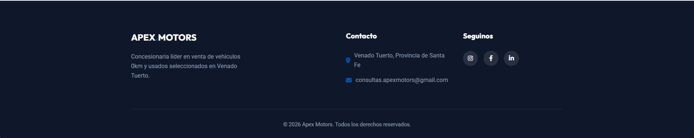

